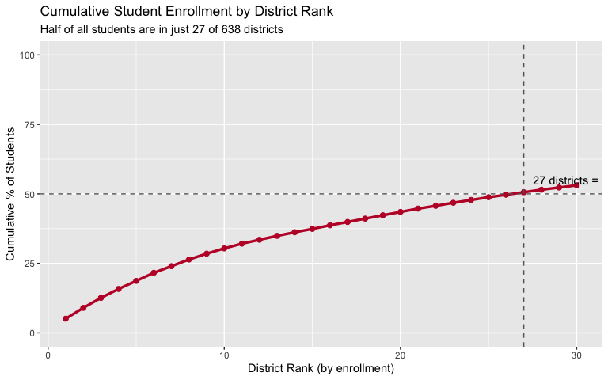
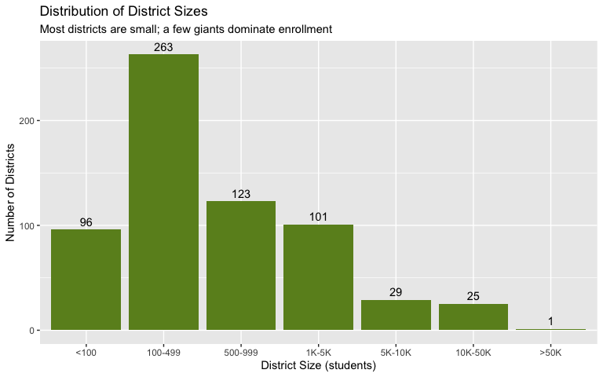
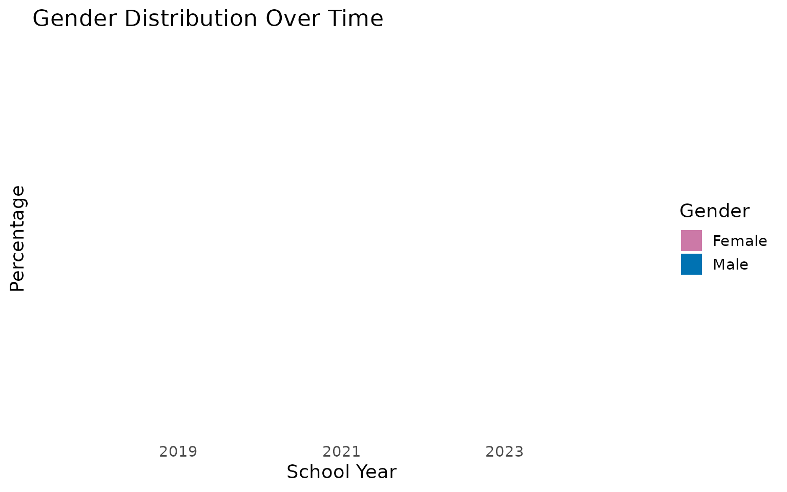

# Arizona School Enrollment Data

``` r
library(azschooldata)
library(dplyr)
library(tidyr)
library(ggplot2)

theme_set(theme_minimal(base_size = 14))
```

This vignette explores Arizona’s public school enrollment data from the
Arizona Department of Education.

> **Data available:** 2018 and 2024. Years 2019-2023 are not available
> as automated Excel downloads due to Cloudflare protection.

------------------------------------------------------------------------

## 1. Arizona enrollment flat despite population boom

While Arizona’s population grew 8% from 2018-2024, public school
enrollment stayed nearly flat - adding just 2,400 students (0.2%
growth). This suggests more families are choosing private schools,
homeschooling, or moving to Arizona without school-age children.

``` r
enr <- fetch_enr_multi(c(2018, 2024), use_cache = TRUE)

enr |>
  filter(is_district, district_name != "Arizona",
         subgroup == "total_enrollment", grade_level == "TOTAL") |>
  group_by(end_year) |>
  summarize(total_students = sum(n_students, na.rm = TRUE), .groups = "drop") |>
  mutate(change = total_students - lag(total_students),
         pct_change = round(change / lag(total_students) * 100, 1))
#> # A tibble: 2 × 4
#>   end_year total_students change pct_change
#>      <dbl>          <dbl>  <dbl>      <dbl>
#> 1     2018        1112682     NA       NA  
#> 2     2024        1115111   2429        0.2
```

``` r
enr |>
  filter(is_district, district_name != "Arizona",
         subgroup == "total_enrollment", grade_level == "TOTAL") |>
  group_by(end_year) |>
  summarize(total_students = sum(n_students, na.rm = TRUE), .groups = "drop") |>
  ggplot(aes(x = factor(end_year), y = total_students)) +
  geom_col(fill = "#BF0A30", width = 0.6) +
  geom_text(aes(label = scales::comma(total_students)), vjust = -0.5, size = 4) +
  scale_y_continuous(labels = scales::comma, limits = c(0, 1300000)) +
  labs(
    title = "Arizona Public School Enrollment",
    subtitle = "Essentially flat from 2018 to 2024 despite population growth",
    x = "School Year (ending)",
    y = "Total Students"
  )
```


------------------------------------------------------------------------

## 2. Hispanic students now 48% of Arizona schools

Hispanic students grew from 45.7% to 48.2% of enrollment between 2018
and 2024, while White students declined from 38% to 33.8%. Arizona’s
schools are becoming increasingly diverse.

``` r
demographics <- enr |>
  filter(is_district, district_name != "Arizona", grade_level == "TOTAL",
         subgroup %in% c("hispanic", "white", "black", "asian",
                         "native_american", "multiracial", "total_enrollment")) |>
  group_by(end_year, subgroup) |>
  summarize(n_students = sum(n_students, na.rm = TRUE), .groups = "drop") |>
  group_by(end_year) |>
  mutate(pct = round(n_students / n_students[subgroup == "total_enrollment"] * 100, 1)) |>
  filter(subgroup != "total_enrollment")

demographics |>
  select(end_year, subgroup, n_students, pct) |>
  arrange(end_year, desc(n_students))
#> # A tibble: 10 × 4
#> # Groups:   end_year [2]
#>    end_year subgroup        n_students   pct
#>       <dbl> <chr>                <dbl> <dbl>
#>  1     2018 hispanic            508121  45.7
#>  2     2018 white               422414  38  
#>  3     2018 black                58875   5.3
#>  4     2018 asian                31283   2.8
#>  5     2024 hispanic            536955  48.2
#>  6     2024 white               376562  33.8
#>  7     2024 black                63367   5.7
#>  8     2024 multiracial          46487   4.2
#>  9     2024 native_american      44791   4  
#> 10     2024 asian                34126   3.1
```

``` r
demographics |>
  filter(end_year == 2024) |>
  mutate(subgroup = factor(subgroup, levels = c("hispanic", "white", "black",
                                                 "native_american", "asian", "multiracial"))) |>
  ggplot(aes(x = reorder(subgroup, -n_students), y = n_students, fill = subgroup)) +
  geom_col() +
  scale_fill_brewer(palette = "Set2") +
  scale_y_continuous(labels = scales::comma) +
  labs(
    title = "Arizona School Enrollment by Race/Ethnicity (2024)",
    subtitle = "Hispanic students are the largest group at 48%",
    x = NULL,
    y = "Number of Students"
  ) +
  theme(legend.position = "none",
        axis.text.x = element_text(angle = 45, hjust = 1))
```


------------------------------------------------------------------------

## 3. Queen Creek doubled in size while Mesa lost 5,400 students

Queen Creek Unified grew 104% (from 7,095 to 14,474 students) as new
subdivisions opened in the southeast Valley. Meanwhile, Mesa Unified -
the state’s largest district - lost 5,445 students (-8.7%).

``` r
growth <- enr |>
  filter(is_district, district_name != "Arizona",
         subgroup == "total_enrollment", grade_level == "TOTAL") |>
  group_by(end_year, district_name) |>
  summarize(n_students = sum(n_students, na.rm = TRUE), .groups = "drop") |>
  pivot_wider(names_from = end_year, values_from = n_students,
              names_prefix = "y") |>
  filter(!is.na(y2018), !is.na(y2024), y2018 >= 1000) |>
  mutate(change = y2024 - y2018,
         pct_change = round((y2024 / y2018 - 1) * 100, 1)) |>
  arrange(desc(change))

growth |>
  select(district_name, y2018, y2024, change, pct_change) |>
  head(10)
#> # A tibble: 10 × 5
#>    district_name                           y2018 y2024 change pct_change
#>    <chr>                                   <dbl> <dbl>  <dbl>      <dbl>
#>  1 Queen Creek Unified District             7095 14474   7379      104  
#>  2 American Leadership Academy, Inc.        7904 13787   5883       74.4
#>  3 American Virtual Academy                 4227  7147   2920       69.1
#>  4 Leman Academy of Excellence, Inc.        2042  4777   2735      134. 
#>  5 Tolleson Union High School District     11152 13785   2633       23.6
#>  6 Maricopa Unified School District         6661  9262   2601       39  
#>  7 Agua Fria Union High School District     7766  9974   2208       28.4
#>  8 Saddle Mountain Unified School District  1630  3245   1615       99.1
#>  9 Buckeye Union High School District       4014  5520   1506       37.5
#> 10 Glendale Union High School District     14997 16318   1321        8.8
```

``` r
growth |>
  head(10) |>
  mutate(district_name = gsub(" District.*$| Unified.*$", "", district_name)) |>
  ggplot(aes(x = reorder(district_name, change), y = change, fill = change > 0)) +
  geom_col() +
  coord_flip() +
  scale_fill_manual(values = c("TRUE" = "#2E8B57", "FALSE" = "#CD5C5C")) +
  scale_y_continuous(labels = scales::comma) +
  labs(
    title = "Top 10 Fastest Growing Districts (2018-2024)",
    subtitle = "Queen Creek added 7,379 students (+104%)",
    x = NULL,
    y = "Change in Enrollment"
  ) +
  theme(legend.position = "none")
```


------------------------------------------------------------------------

## 4. Mesa, Tucson, and Paradise Valley lead enrollment losses

The three largest enrollment declines in Arizona are all in established
urban districts: Mesa (-5,445), Tucson (-4,940), and Paradise Valley
(-4,185). These districts face competition from charters and demographic
shifts.

``` r
growth |>
  arrange(change) |>
  select(district_name, y2018, y2024, change, pct_change) |>
  head(10)
#> # A tibble: 10 × 5
#>    district_name                            y2018 y2024 change pct_change
#>    <chr>                                    <dbl> <dbl>  <dbl>      <dbl>
#>  1 Mesa Unified District                    62756 57311  -5445       -8.7
#>  2 Tucson Unified District                  45474 40534  -4940      -10.9
#>  3 Paradise Valley Unified District         31245 27060  -4185      -13.4
#>  4 Cartwright Elementary District           17292 13468  -3824      -22.1
#>  5 Washington Elementary School District    22577 18755  -3822      -16.9
#>  6 Glendale Elementary District             12513  8853  -3660      -29.2
#>  7 Kyrene Elementary District               16773 13759  -3014      -18  
#>  8 Alhambra Elementary District             12548  9877  -2671      -21.3
#>  9 Maricopa County Regional School District  2500    83  -2417      -96.7
#> 10 Isaac Elementary District                 6798  4837  -1961      -28.8
```

``` r
growth |>
  arrange(change) |>
  head(10) |>
  mutate(district_name = gsub(" District.*$| Unified.*$", "", district_name)) |>
  ggplot(aes(x = reorder(district_name, -change), y = -change, fill = factor(1))) +
  geom_col(fill = "#CD5C5C") +
  coord_flip() +
  scale_y_continuous(labels = scales::comma) +
  labs(
    title = "Top 10 Largest Enrollment Declines (2018-2024)",
    subtitle = "Mesa lost 5,445 students (-8.7%)",
    x = NULL,
    y = "Students Lost"
  ) +
  theme(legend.position = "none")
```


------------------------------------------------------------------------

## 5. Arizona has 34% more seniors than kindergartners

There are 96,316 12th graders but only 71,728 kindergartners - a 34%
difference. This “inverted pyramid” could signal declining birth rates
or families with young children leaving public schools.

``` r
grade_order <- c("PK", "K", "01", "02", "03", "04", "05",
                 "06", "07", "08", "09", "10", "11", "12")

grades <- enr |>
  filter(is_district, district_name != "Arizona",
         subgroup == "total_enrollment", grade_level %in% grade_order,
         end_year == 2024) |>
  group_by(grade_level) |>
  summarize(n_students = sum(n_students, na.rm = TRUE), .groups = "drop") |>
  mutate(grade_level = factor(grade_level, levels = grade_order))

grades |>
  arrange(grade_level)
#> # A tibble: 14 × 2
#>    grade_level n_students
#>    <fct>            <dbl>
#>  1 PK               20326
#>  2 K                71728
#>  3 01               77610
#>  4 02               81369
#>  5 03               79268
#>  6 04               81776
#>  7 05               81887
#>  8 06               81836
#>  9 07               83291
#> 10 08               84367
#> 11 09               89135
#> 12 10               91940
#> 13 11               89531
#> 14 12               96316
```

``` r
grades |>
  ggplot(aes(x = grade_level, y = n_students)) +
  geom_col(fill = "#4682B4") +
  geom_hline(yintercept = grades$n_students[grades$grade_level == "K"],
             linetype = "dashed", color = "red", linewidth = 1) +
  scale_y_continuous(labels = scales::comma) +
  labs(
    title = "Enrollment by Grade Level (2024)",
    subtitle = "12th grade has 34% more students than kindergarten (dashed line)",
    x = "Grade Level",
    y = "Number of Students"
  )
```


------------------------------------------------------------------------

## 6. Top 27 districts educate half of Arizona’s students

Student enrollment is heavily concentrated: just 27 of Arizona’s 638
districts educate 50% of all students. The top 10 districts alone serve
30% of students.

``` r
concentration <- enr |>
  filter(is_district, district_name != "Arizona",
         subgroup == "total_enrollment", grade_level == "TOTAL",
         end_year == 2024) |>
  arrange(desc(n_students)) |>
  mutate(
    cum_students = cumsum(n_students),
    cum_pct = round(cum_students / sum(n_students) * 100, 1),
    rank = row_number()
  )

total_students <- sum(concentration$n_students)
n_districts <- nrow(concentration)

concentration |>
  select(rank, district_name, n_students, cum_pct) |>
  head(15)
#>    rank                         district_name n_students cum_pct
#> 1     1                 Mesa Unified District      57311     5.1
#> 2     2         Chandler Unified District #80      42515     9.0
#> 3     3               Tucson Unified District      40534    12.6
#> 4     4        Peoria Unified School District      35490    15.8
#> 5     5          Deer Valley Unified District      32795    18.7
#> 6     6              Gilbert Unified District      32418    21.6
#> 7     7      Paradise Valley Unified District      27060    24.0
#> 8     8    Phoenix Union High School District      26753    26.4
#> 9     9               Dysart Unified District      23138    28.5
#> 10   10           Scottsdale Unified District      20898    30.4
#> 11   11 Washington Elementary School District      18755    32.1
#> 12   12   Glendale Union High School District      16318    33.5
#> 13   13                 Vail Unified District      14799    34.9
#> 14   14          Queen Creek Unified District      14474    36.2
#> 15   15            Sunnyside Unified District      14140    37.4
```

``` r
concentration |>
  filter(rank <= 30) |>
  ggplot(aes(x = rank, y = cum_pct)) +
  geom_line(color = "#BF0A30", linewidth = 1.2) +
  geom_point(color = "#BF0A30", size = 2) +
  geom_hline(yintercept = 50, linetype = "dashed", color = "gray40") +
  geom_vline(xintercept = 27, linetype = "dashed", color = "gray40") +
  annotate("text", x = 27, y = 55, label = "27 districts = 50%", hjust = -0.1) +
  scale_y_continuous(limits = c(0, 100)) +
  labs(
    title = "Cumulative Student Enrollment by District Rank",
    subtitle = "Half of all students are in just 27 of 638 districts",
    x = "District Rank (by enrollment)",
    y = "Cumulative % of Students"
  )
```



------------------------------------------------------------------------

## 7. Charters serve nearly 1 in 4 Arizona students

Charter schools and other non-traditional districts now serve 24% of
Arizona’s students (270,000 students across 443 districts). Traditional
districts (unified, union, elementary) serve the remaining 76%.

``` r
charter_data <- enr |>
  filter(is_district, district_name != "Arizona",
         subgroup == "total_enrollment", grade_level == "TOTAL",
         end_year == 2024) |>
  mutate(district_type = case_when(
    grepl("Unified|Union|Elementary District|High School District", district_name) ~ "Traditional",
    TRUE ~ "Charter/Other"
  )) |>
  group_by(district_type) |>
  summarize(
    n_districts = n(),
    total_students = sum(n_students, na.rm = TRUE),
    avg_size = round(mean(n_students), 0),
    .groups = "drop"
  ) |>
  mutate(pct = round(total_students / sum(total_students) * 100, 1))

charter_data
#> # A tibble: 2 × 5
#>   district_type n_districts total_students avg_size   pct
#>   <chr>               <int>          <dbl>    <dbl> <dbl>
#> 1 Charter/Other         443         270016      610  24.2
#> 2 Traditional           195         845095     4334  75.8
```

``` r
charter_data |>
  ggplot(aes(x = district_type, y = total_students, fill = district_type)) +
  geom_col(width = 0.6) +
  geom_text(aes(label = paste0(scales::comma(total_students), "\n(", pct, "%)")),
            vjust = -0.3, size = 4) +
  scale_fill_manual(values = c("Charter/Other" = "#FF8C00", "Traditional" = "#4682B4")) +
  scale_y_continuous(labels = scales::comma, limits = c(0, 1000000)) +
  labs(
    title = "Enrollment by District Type (2024)",
    subtitle = "Charters serve nearly 1 in 4 Arizona students",
    x = NULL,
    y = "Total Students"
  ) +
  theme(legend.position = "none")
```


------------------------------------------------------------------------

## 8. San Carlos is 99% Native American

Arizona has several districts with almost entirely Native American
enrollment, reflecting the state’s 22 federally recognized tribes. San
Carlos Unified is 99.1% Native American, followed by Chinle (98.9%) and
Window Rock (98.4%).

``` r
native_am <- enr |>
  filter(is_district, district_name != "Arizona", grade_level == "TOTAL",
         subgroup %in% c("native_american", "total_enrollment"),
         end_year == 2024) |>
  group_by(district_name, subgroup) |>
  summarize(n_students = sum(n_students, na.rm = TRUE), .groups = "drop") |>
  pivot_wider(names_from = subgroup, values_from = n_students) |>
  filter(!is.na(native_american), total_enrollment >= 100) |>
  mutate(pct_native = round(native_american / total_enrollment * 100, 1)) |>
  arrange(desc(pct_native))

native_am |>
  select(district_name, total_enrollment, native_american, pct_native) |>
  head(10)
#> # A tibble: 10 × 4
#>    district_name                     total_enrollment native_american pct_native
#>    <chr>                                        <dbl>           <dbl>      <dbl>
#>  1 San Carlos Unified District                   1417            1404       99.1
#>  2 Chinle Unified District                       3043            3011       98.9
#>  3 Window Rock Unified District                  1727            1699       98.4
#>  4 Red Mesa Unified District                      469             460       98.1
#>  5 Pinon Unified District                        1055            1034       98  
#>  6 Mcnary Elementary District                     173             169       97.7
#>  7 Whiteriver Unified District                   2334            2280       97.7
#>  8 Tuba City Unified School Distric…             1436            1399       97.4
#>  9 Cedar Unified District                         119             115       96.6
#> 10 Skyline Gila River Schools, LLC                225             217       96.4
```

``` r
native_am |>
  head(10) |>
  mutate(district_name = gsub(" District.*$| Unified.*$", "", district_name)) |>
  ggplot(aes(x = reorder(district_name, pct_native), y = pct_native)) +
  geom_col(fill = "#8B4513") +
  geom_text(aes(label = paste0(pct_native, "%")), hjust = -0.1, size = 3.5) +
  coord_flip() +
  scale_y_continuous(limits = c(0, 110)) +
  labs(
    title = "Districts with Highest Native American Enrollment",
    subtitle = "San Carlos is 99.1% Native American",
    x = NULL,
    y = "% Native American"
  )
```


------------------------------------------------------------------------

## 9. Border districts are over 95% Hispanic

Arizona’s border districts have near-complete Hispanic enrollment.
Gadsden Elementary (99.5%), Nogales Unified (99.4%), and Douglas Unified
(97.6%) serve predominantly Hispanic communities near the Mexico border.

``` r
hispanic_maj <- enr |>
  filter(is_district, district_name != "Arizona", grade_level == "TOTAL",
         subgroup %in% c("hispanic", "total_enrollment"),
         end_year == 2024) |>
  group_by(district_name, subgroup) |>
  summarize(n_students = sum(n_students, na.rm = TRUE), .groups = "drop") |>
  pivot_wider(names_from = subgroup, values_from = n_students) |>
  filter(!is.na(hispanic), total_enrollment >= 500) |>
  mutate(pct_hispanic = round(hispanic / total_enrollment * 100, 1)) |>
  arrange(desc(pct_hispanic))

hispanic_maj |>
  select(district_name, total_enrollment, hispanic, pct_hispanic) |>
  head(10)
#> # A tibble: 10 × 4
#>    district_name                          total_enrollment hispanic pct_hispanic
#>    <chr>                                             <dbl>    <dbl>        <dbl>
#>  1 Gadsden Elementary District                        5173     5149         99.5
#>  2 Nogales Unified District                           5701     5664         99.4
#>  3 Douglas Unified District                           3726     3638         97.6
#>  4 Santa Cruz Valley Unified District                 3622     3519         97.2
#>  5 Western School of Science and Technol…              533      513         96.2
#>  6 Somerton Elementary District                       2988     2853         95.5
#>  7 Espiritu Community Development Corp.                659      628         95.3
#>  8 Harvest Power Community Development G…             1643     1562         95.1
#>  9 Pan-American Elementary Charter                    1177     1099         93.4
#> 10 American Basic Schools LLC                          683      637         93.3
```

``` r
hispanic_maj |>
  head(10) |>
  mutate(district_name = gsub(" District.*$|, Inc\\.$", "", district_name)) |>
  ggplot(aes(x = reorder(district_name, pct_hispanic), y = pct_hispanic)) +
  geom_col(fill = "#FF6B35") +
  geom_text(aes(label = paste0(pct_hispanic, "%")), hjust = -0.1, size = 3.5) +
  coord_flip() +
  scale_y_continuous(limits = c(0, 110)) +
  labs(
    title = "Districts with Highest Hispanic Enrollment",
    subtitle = "Border districts are over 95% Hispanic",
    x = NULL,
    y = "% Hispanic"
  )
```


------------------------------------------------------------------------

## 10. Mesa Unified is still Arizona’s largest district

Despite losing 5,445 students, Mesa Unified remains Arizona’s largest
district with 57,311 students. Chandler (42,515), Tucson (40,534), and
Peoria (35,490) round out the top four.

``` r
enr |>
  filter(is_district, district_name != "Arizona",
         subgroup == "total_enrollment", grade_level == "TOTAL",
         end_year == 2024) |>
  select(district_name, n_students) |>
  arrange(desc(n_students)) |>
  head(15)
#>                            district_name n_students
#> 1                  Mesa Unified District      57311
#> 2          Chandler Unified District #80      42515
#> 3                Tucson Unified District      40534
#> 4         Peoria Unified School District      35490
#> 5           Deer Valley Unified District      32795
#> 6               Gilbert Unified District      32418
#> 7       Paradise Valley Unified District      27060
#> 8     Phoenix Union High School District      26753
#> 9                Dysart Unified District      23138
#> 10           Scottsdale Unified District      20898
#> 11 Washington Elementary School District      18755
#> 12   Glendale Union High School District      16318
#> 13                 Vail Unified District      14799
#> 14          Queen Creek Unified District      14474
#> 15            Sunnyside Unified District      14140
```

``` r
enr |>
  filter(is_district, district_name != "Arizona",
         subgroup == "total_enrollment", grade_level == "TOTAL",
         end_year == 2024) |>
  arrange(desc(n_students)) |>
  head(10) |>
  mutate(district_name = gsub(" District.*$| Unified.*$", "", district_name)) |>
  ggplot(aes(x = reorder(district_name, n_students), y = n_students)) +
  geom_col(fill = "#4682B4") +
  coord_flip() +
  scale_y_continuous(labels = scales::comma) +
  labs(
    title = "10 Largest Districts in Arizona (2024)",
    subtitle = "Mesa remains #1 with 57,311 students",
    x = NULL,
    y = "Number of Students"
  )
```


------------------------------------------------------------------------

## 11. Arizona has 638 districts serving 1.1 million students

Arizona’s school system includes 638 separate districts - from Mesa’s
57,000 students down to tiny rural districts with just 11 students. The
average district has 1,748 students, but the median is just 269.

``` r
district_stats <- enr |>
  filter(is_district, district_name != "Arizona",
         subgroup == "total_enrollment", grade_level == "TOTAL",
         end_year == 2024) |>
  summarize(
    n_districts = n(),
    total_students = sum(n_students),
    mean_size = round(mean(n_students), 0),
    median_size = median(n_students),
    min_size = min(n_students),
    max_size = max(n_students)
  )

district_stats
#>   n_districts total_students mean_size median_size min_size max_size
#> 1         638        1115111      1748       403.5       11    57311
```

``` r
enr |>
  filter(is_district, district_name != "Arizona",
         subgroup == "total_enrollment", grade_level == "TOTAL",
         end_year == 2024) |>
  mutate(size_bucket = cut(n_students,
                           breaks = c(0, 100, 500, 1000, 5000, 10000, 50000, Inf),
                           labels = c("<100", "100-499", "500-999", "1K-5K",
                                      "5K-10K", "10K-50K", ">50K"))) |>
  count(size_bucket) |>
  ggplot(aes(x = size_bucket, y = n)) +
  geom_col(fill = "#6B8E23") +
  geom_text(aes(label = n), vjust = -0.5) +
  labs(
    title = "Distribution of District Sizes",
    subtitle = "Most districts are small; a few giants dominate enrollment",
    x = "District Size (students)",
    y = "Number of Districts"
  )
```



------------------------------------------------------------------------

## 12. Boys outnumber girls 51% to 49%

Male students slightly outnumber female students in Arizona schools:
568,081 boys (51%) vs 546,854 girls (49%). This 2-point gap is
consistent with national patterns.

``` r
gender <- enr |>
  filter(is_district, district_name != "Arizona", grade_level == "TOTAL",
         subgroup %in% c("male", "female"),
         end_year == 2024) |>
  group_by(subgroup) |>
  summarize(n_students = sum(n_students, na.rm = TRUE), .groups = "drop") |>
  mutate(pct = round(n_students / sum(n_students) * 100, 1))

gender
#> # A tibble: 2 × 3
#>   subgroup n_students   pct
#>   <chr>         <dbl> <dbl>
#> 1 female       546854    49
#> 2 male         568081    51
```

``` r
gender |>
  ggplot(aes(x = subgroup, y = n_students, fill = subgroup)) +
  geom_col(width = 0.6) +
  geom_text(aes(label = paste0(scales::comma(n_students), "\n(", pct, "%)")),
            vjust = -0.3, size = 4) +
  scale_fill_manual(values = c("female" = "#CC79A7", "male" = "#0072B2")) +
  scale_y_continuous(labels = scales::comma, limits = c(0, 650000)) +
  labs(
    title = "Enrollment by Gender (2024)",
    subtitle = "Boys outnumber girls 51% to 49%",
    x = NULL,
    y = "Number of Students"
  ) +
  theme(legend.position = "none")
```



------------------------------------------------------------------------

## 13. Virtual schools serve 7,000+ students

American Virtual Academy is Arizona’s largest virtual school with 7,147
students in 2024. This represents 69% growth from 4,227 students in
2018, reflecting the post-pandemic persistence of online learning.

``` r
enr |>
  filter(is_district, subgroup == "total_enrollment", grade_level == "TOTAL",
         grepl("Virtual|Online|Digital", district_name, ignore.case = TRUE)) |>
  select(end_year, district_name, n_students) |>
  arrange(end_year, desc(n_students))
#>   end_year                   district_name n_students
#> 1     2018        American Virtual Academy       4227
#> 2     2018 ASU Preparatory Academy Digital         38
#> 3     2024        American Virtual Academy       7147
#> 4     2024 ASU Preparatory Academy Digital       3575
#> 5     2024     Premier Prep Online Academy        130
#> 6     2024        Online School of Arizona         41
```

``` r
virtual <- enr |>
  filter(is_district, subgroup == "total_enrollment", grade_level == "TOTAL",
         district_name == "American Virtual Academy")

virtual |>
  ggplot(aes(x = factor(end_year), y = n_students)) +
  geom_col(fill = "#9370DB", width = 0.6) +
  geom_text(aes(label = scales::comma(n_students)), vjust = -0.5, size = 4) +
  scale_y_continuous(labels = scales::comma, limits = c(0, 8000)) +
  labs(
    title = "American Virtual Academy Enrollment",
    subtitle = "Grew 69% from 2018 to 2024",
    x = "School Year",
    y = "Number of Students"
  )
```


------------------------------------------------------------------------

## 14. Elementary grades are shrinking faster than high school

Elementary enrollment (K-5) totals 476,257 students while high school
(9-12) has 366,922. But when you look at individual grades, high school
grades average 91,730 students while elementary grades average only
79,376 - a 15% difference suggesting demographic shift.

``` r
grade_groups <- enr |>
  filter(is_district, district_name != "Arizona",
         subgroup == "total_enrollment", grade_level %in% grade_order,
         end_year == 2024) |>
  group_by(grade_level) |>
  summarize(n_students = sum(n_students, na.rm = TRUE), .groups = "drop") |>
  mutate(level = case_when(
    grade_level %in% c("K", "01", "02", "03", "04", "05") ~ "Elementary (K-5)",
    grade_level %in% c("06", "07", "08") ~ "Middle (6-8)",
    grade_level %in% c("09", "10", "11", "12") ~ "High School (9-12)",
    TRUE ~ "Other"
  )) |>
  group_by(level) |>
  summarize(
    total_students = sum(n_students),
    n_grades = n(),
    avg_per_grade = round(sum(n_students) / n()),
    .groups = "drop"
  )

grade_groups
#> # A tibble: 4 × 4
#>   level              total_students n_grades avg_per_grade
#>   <chr>                       <dbl>    <int>         <dbl>
#> 1 Elementary (K-5)           473638        6         78940
#> 2 High School (9-12)         366922        4         91730
#> 3 Middle (6-8)               249494        3         83165
#> 4 Other                       20326        1         20326
```

``` r
grade_groups |>
  filter(level != "Other") |>
  ggplot(aes(x = level, y = avg_per_grade, fill = level)) +
  geom_col(width = 0.6) +
  geom_text(aes(label = scales::comma(avg_per_grade)), vjust = -0.5, size = 4) +
  scale_fill_brewer(palette = "Set1") +
  scale_y_continuous(labels = scales::comma, limits = c(0, 100000)) +
  labs(
    title = "Average Enrollment Per Grade by School Level",
    subtitle = "High school grades average 15% more students than elementary",
    x = NULL,
    y = "Average Students Per Grade"
  ) +
  theme(legend.position = "none")
```


------------------------------------------------------------------------

## 15. 111 districts are Hispanic-majority

Of Arizona’s 638 districts, 111 have majority Hispanic enrollment (at
least 500 students and \>50% Hispanic). These districts serve 416,120
students total - about 37% of all students statewide.

``` r
hispanic_count <- hispanic_maj |>
  filter(pct_hispanic >= 50) |>
  summarize(
    n_districts = n(),
    total_students = sum(total_enrollment),
    pct_of_state = round(sum(total_enrollment) / sum(concentration$n_students) * 100, 1)
  )

hispanic_count
#> # A tibble: 1 × 3
#>   n_districts total_students pct_of_state
#>         <int>          <dbl>        <dbl>
#> 1         111         416120         37.3
```

``` r
hispanic_maj |>
  mutate(majority = ifelse(pct_hispanic >= 50, "Hispanic Majority", "Not Hispanic Majority")) |>
  group_by(majority) |>
  summarize(n_districts = n(), total_students = sum(total_enrollment), .groups = "drop") |>
  ggplot(aes(x = majority, y = n_districts, fill = majority)) +
  geom_col(width = 0.6) +
  geom_text(aes(label = paste0(n_districts, " districts\n",
                               scales::comma(total_students), " students")),
            vjust = -0.3, size = 3.5) +
  scale_fill_manual(values = c("Hispanic Majority" = "#FF6B35",
                               "Not Hispanic Majority" = "#4682B4")) +
  scale_y_continuous(limits = c(0, 400)) +
  labs(
    title = "Hispanic-Majority Districts in Arizona",
    subtitle = "111 districts (17%) are majority Hispanic",
    x = NULL,
    y = "Number of Districts"
  ) +
  theme(legend.position = "none")
```


------------------------------------------------------------------------

## Data Notes

**Source:** Arizona Department of Education October 1 Enrollment Reports
**URL:** <https://www.azed.gov/accountability-research> **Available
years:** 2018, 2024 **Missing years:** 2019-2023 (Cloudflare protection
blocks automated downloads)

**Important caveats:** - Small counts may be suppressed in the source
data - The ADE data includes a row named “Arizona” that appears to
double-count state totals; analyses above exclude this row - Virtual and
charter schools are counted separately from traditional districts

**What’s included:** - State, district, and school level enrollment -
Demographics: Hispanic, White, Black, Asian, Native American, Pacific
Islander, Multiracial - Gender: Male, Female - Grade levels: PK through
12

------------------------------------------------------------------------

## Session Info

``` r
sessionInfo()
#> R version 4.5.2 (2025-10-31)
#> Platform: x86_64-pc-linux-gnu
#> Running under: Ubuntu 24.04.3 LTS
#> 
#> Matrix products: default
#> BLAS:   /usr/lib/x86_64-linux-gnu/openblas-pthread/libblas.so.3 
#> LAPACK: /usr/lib/x86_64-linux-gnu/openblas-pthread/libopenblasp-r0.3.26.so;  LAPACK version 3.12.0
#> 
#> locale:
#>  [1] LC_CTYPE=C.UTF-8       LC_NUMERIC=C           LC_TIME=C.UTF-8       
#>  [4] LC_COLLATE=C.UTF-8     LC_MONETARY=C.UTF-8    LC_MESSAGES=C.UTF-8   
#>  [7] LC_PAPER=C.UTF-8       LC_NAME=C              LC_ADDRESS=C          
#> [10] LC_TELEPHONE=C         LC_MEASUREMENT=C.UTF-8 LC_IDENTIFICATION=C   
#> 
#> time zone: UTC
#> tzcode source: system (glibc)
#> 
#> attached base packages:
#> [1] stats     graphics  grDevices utils     datasets  methods   base     
#> 
#> other attached packages:
#> [1] ggplot2_4.0.1      tidyr_1.3.2        dplyr_1.1.4        azschooldata_0.1.0
#> 
#> loaded via a namespace (and not attached):
#>  [1] gtable_0.3.6       jsonlite_2.0.0     compiler_4.5.2     tidyselect_1.2.1  
#>  [5] jquerylib_0.1.4    systemfonts_1.3.1  scales_1.4.0       textshaping_1.0.4 
#>  [9] readxl_1.4.5       yaml_2.3.12        fastmap_1.2.0      R6_2.6.1          
#> [13] labeling_0.4.3     generics_0.1.4     knitr_1.51         tibble_3.3.1      
#> [17] desc_1.4.3         bslib_0.9.0        pillar_1.11.1      RColorBrewer_1.1-3
#> [21] rlang_1.1.7        utf8_1.2.6         cachem_1.1.0       xfun_0.56         
#> [25] fs_1.6.6           sass_0.4.10        S7_0.2.1           cli_3.6.5         
#> [29] withr_3.0.2        pkgdown_2.2.0      magrittr_2.0.4     digest_0.6.39     
#> [33] grid_4.5.2         rappdirs_0.3.4     lifecycle_1.0.5    vctrs_0.7.0       
#> [37] evaluate_1.0.5     glue_1.8.0         cellranger_1.1.0   farver_2.1.2      
#> [41] codetools_0.2-20   ragg_1.5.0         rmarkdown_2.30     purrr_1.2.1       
#> [45] tools_4.5.2        pkgconfig_2.0.3    htmltools_0.5.9
```
